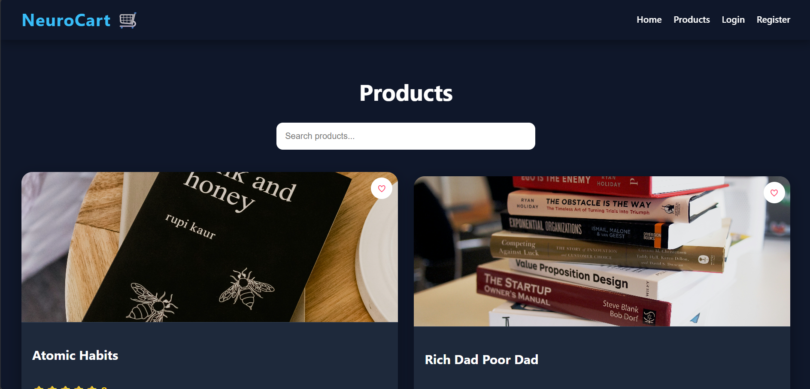
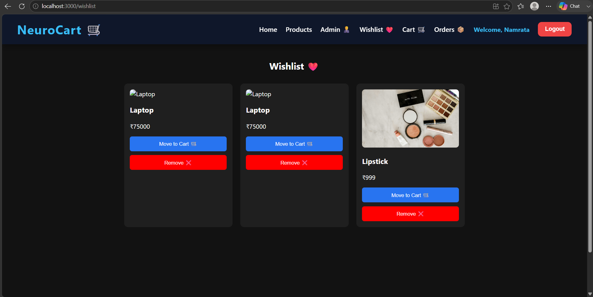
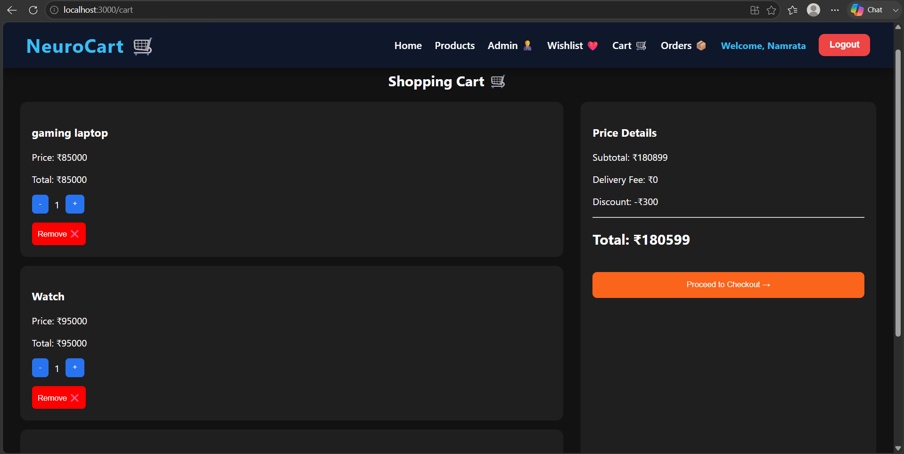
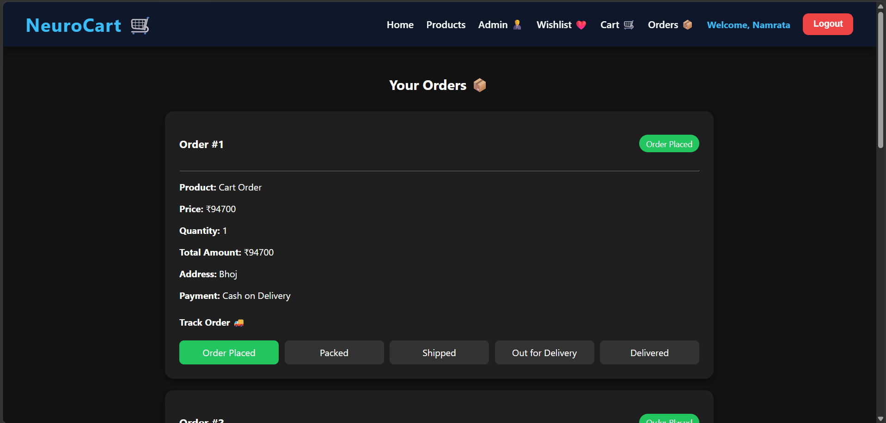
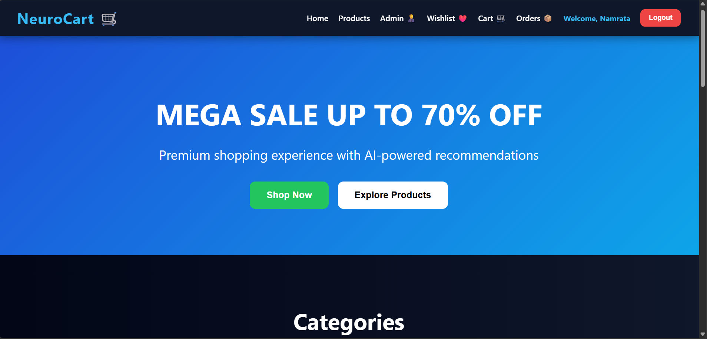

# 🛒 NeuroCart

A modern full-stack E-Commerce web application built using **Spring Boot**, **React.js**, **MySQL**, and **JWT Authentication**.

## 🚀 Project Overview

NeuroCart is a complete online shopping platform that allows users to browse products, manage carts and wishlists, place orders, track deliveries, and submit product reviews. It also includes a powerful admin panel for managing products and orders.

---

## ✨ Features

### 👤 User Features

* User Registration & Login
* JWT Authentication & Authorization
* Browse Products
* Product Search
* Product Categories
* Product Details Page
* Add to Cart
* Wishlist Management
* Buy Now Functionality
* Address Management
* Payment Selection
* Order Placement
* Order Tracking
* Product Reviews & Ratings

### 👨‍💼 Admin Features

* Admin Dashboard
* Add Products
* Edit Products
* Delete Products
* Manage Orders
* Update Order Status
* Product Management

---

## 🛠️ Tech Stack

### Frontend

* React.js
* React Router DOM
* Axios
* CSS

### Backend

* Spring Boot
* Spring Security
* JWT Authentication
* REST APIs
* Maven

### Database

* MySQL

---

## 📸 Screenshots

### 🏠 Home Page


### 🛍️ Products Page



### 📄 Product Details


### ❤️ Wishlist



### 🛒 Shopping Cart



### 📦 Order Tracking



### 👨‍💼 Admin Dashboard



---

## ⚙️ Installation

### Clone Repository

```bash
git clone https://github.com/NamrataPatil-data/Neurocart.git
```

### Backend Setup

```bash
mvn clean install
mvn spring-boot:run
```

### Frontend Setup

```bash
cd neurocart-frontend
npm install
npm start
```

---

## 🔐 Authentication

NeuroCart uses JWT-based authentication to secure user sessions and protect admin-only functionality.

---

## 🎯 Future Enhancements

* Online Payment Gateway Integration
* Product Image Uploads
* Email Notifications
* Inventory Management
* Sales Analytics Dashboard
* Responsive Mobile Design
* AI-Based Product Recommendations

---

## 👩‍💻 Author

**Namrata Patil**

Computer Science and Business Systems Engineer

GitHub: https://github.com/NamrataPatil-data

---

⭐ If you like this project, please give it a star!
